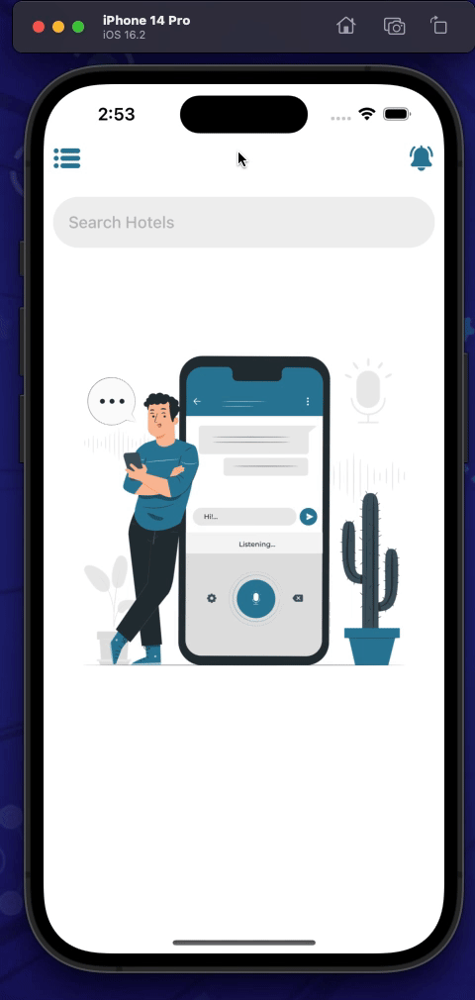

This is a Animated Sidebar in [**React Native**](https://reactnative.dev) , made by [**Deepanshu Dawar**](https://www.linkedin.com/in/deepanshu-dawar-b87767262)

| Android                                                                  | iOS                                                             |
| ------------------------------------------------------------------------ | --------------------------------------------------------------- |
|  |  |

## Description

This project utilizes both [**Drawer**](https://reactnavigation.org/docs/drawer-based-navigation) and [**Stack**](https://reactnavigation.org/docs/hello-react-navigation) navigation , accompanied by animations implemented with [**react-native-reanimated**](https://www.google.com/url?sa=t&source=web&rct=j&opi=89978449&url=https://www.npmjs.com/package/react-native-reanimated&ved=2ahUKEwiz9o2I7sOFAxXeSWwGHb2dBzUQFnoECAYQAQ&usg=AOvVaw1VbC_WdahT8l_-9fWzxj9W) Library.

## Running the Application

### Step 1: Start the Metro Server

```bash
npm start
```

### Step 2: Start your Application

#### For Android

```bash
npm run android
```

#### For iOS

```bash
npm run ios
```

## Congratulations ! :tada:

You've successfully ran Animated Sidebar. :partying_face:
